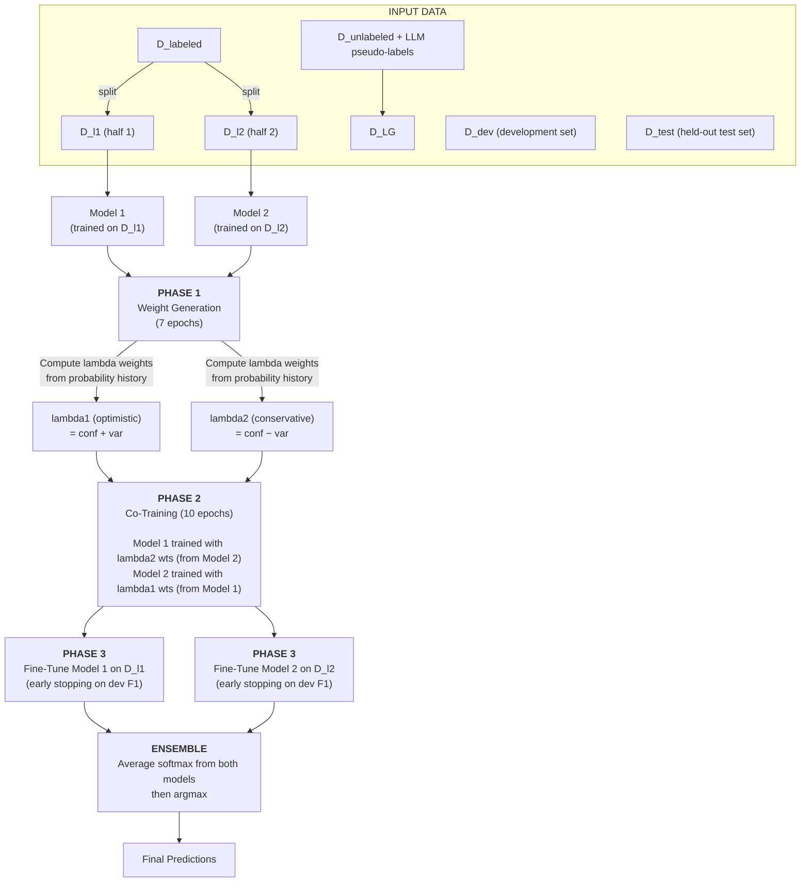

# LG-CoTrain (CrisisMMD)

**LLM-Guided Co-Training for Crisis Tweet Classification**

> **Dashboard** — View dataset exploration and experiment results: [results/dashboard.html](results/dashboard.html)
> _(Open locally in a browser; rebuild anytime with `python -m lg_cotrain.dashboard`)_

A semi-supervised co-training pipeline that classifies crisis tweets. It combines a small set of human-labeled tweets with LLM pseudo-labeled tweets (e.g., from GPT-4o) using a 3-phase training approach with two models. Now adapted for the **CrisisMMD v2.0** dataset with support for three tasks and three modalities.

---

## Table of Contents

- [Motivation](#motivation)
- [How It Works](#how-it-works)
  - [Phase 1 — Weight Generation](#phase-1--weight-generation)
  - [Phase 2 — Co-Training](#phase-2--co-training)
  - [Phase 3 — Fine-Tuning](#phase-3--fine-tuning)
- [Dataset: CrisisMMD v2.0](#dataset-crisismmd-v20)
- [Data Layout](#data-layout)
- [Installation](#installation)
- [Usage](#usage)
  - [Preprocessing](#preprocessing)
  - [Single Experiment](#single-experiment)
  - [Batch Mode](#batch-mode)
  - [Hyperparameter Tuning with Optuna](#hyperparameter-tuning-with-optuna)
  - [All CLI Options](#all-cli-options)
- [Output Format](#output-format)
- [Project Structure](#project-structure)
- [Testing](#testing)
- [Design Decisions](#design-decisions)
- [References](#references)

---

## Motivation

During disasters, rapid classification of social media posts helps humanitarian organizations prioritize response efforts. However, manually labeling enough tweets to train a reliable classifier is slow and expensive.

LG-CoTrain addresses this by:

1. Starting with a **small set of human-labeled tweets** (as few as 5 per class)
2. Using an **LLM (e.g., GPT-4o) to pseudo-label** a large pool of unlabeled tweets
3. Computing **per-sample reliability weights** that measure how trustworthy each pseudo-label is
4. **Co-training two classifiers** that teach each other using these weighted pseudo-labels
5. **Fine-tuning** on the small labeled set with early stopping

The result is a classifier that significantly outperforms training on labeled data alone, even when labeled data is extremely scarce.

---

## How It Works

The pipeline has three phases, each building on the previous one. Two models work together throughout, exchanging information about which pseudo-labels they trust.



### Phase 1 — Weight Generation

**Goal**: Learn how much each pseudo-label can be trusted.

Two fresh models are trained **separately** — Model 1 on D_l1, Model 2 on D_l2 (stratified halves of the small labeled set). After training, each model predicts softmax probabilities for every sample in the pseudo-labeled set (D_LG). These probabilities seed Phase 2's `WeightTracker`.

```
confidence  = p(pseudo_label | x; theta) from the final Phase 1 epoch
variability = 0  (only one observation)

lambda_optimistic (lambda1)    = confidence + 0 = confidence
lambda_conservative (lambda2)  = max(confidence - 0, 0) = confidence
```

As Phase 2 proceeds, confidence and variability are recomputed as new observations accumulate each epoch.

**Intuition**:

- **High confidence, low variability** → high weight (model trusts the pseudo-label)
- **Low confidence, high variability** → low weight (model is unsure)
- lambda1 (optimistic) gives benefit of the doubt; lambda2 (conservative) is more strict

#### Phase 1 Seeding Strategy

The `--phase1-seed-strategy` flag controls which Phase 1 epoch's probabilities seed Phase 2.

| Strategy | Source | How it works |
| --- | --- | --- |
| `last` (default) | **Algorithm 1 in the paper** | Seeds with the **final** Phase 1 epoch's probabilities |
| `best` | **Our experimental extension** | Seeds from the epoch with highest ensemble dev macro-F1 |

### Phase 2 — Co-Training

**Goal**: Train strong classifiers on the large pseudo-labeled set, weighted by trust.

Two **new** models are initialized fresh. They train on D_LG using **weighted cross-entropy loss**:

- **Model 1**'s loss is weighted by **lambda2** (conservative weights from Model 2)
- **Model 2**'s loss is weighted by **lambda1** (optimistic weights from Model 1)

This cross-weighting is the core of co-training — each model guides the other.

### Phase 3 — Fine-Tuning

**Goal**: Adapt the co-trained models to the clean labeled data.

Each co-trained model fine-tunes on its respective labeled split with **early stopping**. Final evaluation uses **ensemble prediction**: average softmax from both models, then argmax.

#### Early Stopping Strategies

Six strategies are available via `--stopping-strategy`:

| Strategy | Description |
| --- | --- |
| `baseline` (default) | Patience on ensemble macro-F1 |
| `no_early_stopping` | Run all epochs, restore best checkpoint |
| `per_class_patience` | Stop when every class has independently plateaued |
| `weighted_macro_f1` | Rare-class-weighted stopping metric |
| `balanced_dev` | Resampled dev set for the stopping signal |
| `scaled_threshold` | Delta scales with class imbalance ratio |

---

## Dataset: CrisisMMD v2.0

The dataset contains tweets and images from **7 natural disasters** in 2017, with three annotation tasks:

### Tasks

| Task | Classes | Labels |
| --- | --- | --- |
| **humanitarian** (8 classes) | `affected_individuals`, `infrastructure_and_utility_damage`, `injured_or_dead_people`, `missing_or_found_people`, `not_humanitarian`, `other_relevant_information`, `rescue_volunteering_or_donation_effort`, `vehicle_damage` |
| **informative** (2 classes) | `informative`, `not_informative` |
| **damage** (3 classes) | `little_or_no_damage`, `mild_damage`, `severe_damage` |

### Modalities

| Modality | Description | Model |
| --- | --- | --- |
| `text_only` | Tweet text, deduplicated by tweet_id | BERTweet (`vinai/bertweet-base`) |
| `image_only` | One row per image_id | CLIP ViT (`openai/clip-vit-base-patch32`) — future |
| `text_image` | Text + image paired | BERTweet + CLIP fusion — future |

Note: the damage task uses a single `label` column for all modalities (no separate text/image annotations), while informative and humanitarian tasks have separate `label_text` and `label_image` columns.

### Events (7 disasters, combined in one dataset)

`california_wildfires`, `hurricane_harvey`, `hurricane_irma`, `hurricane_maria`, `iraq_iran_earthquake`, `mexico_earthquake`, `srilanka_floods`

### Split Sizes (humanitarian/informative)

| Split | Rows (text_only) | Rows (image/text_image) |
| --- | --- | --- |
| Train | 11,584 | 13,608 |
| Dev | 2,237 | 2,237 |
| Test | 2,237 | 2,237 |

Each task/modality has **4 budget levels** (5, 10, 25, 50 labeled per class) and **3 seed sets**, giving **12 experiments per task/modality**. Best-effort sampling is used for rare classes (e.g., `missing_or_found_people` has only 28 text_only train samples).

---

## Data Layout

```
data/CrisisMMD_v2.0/
├── original/                          # Raw source TSVs (keep as-is)
│   ├── task_humanitarian_text_img_{train,dev,test}.tsv
│   ├── task_informative_text_img_{train,dev,test}.tsv
│   ├── task_damage_text_img_{train,dev,test}.tsv
│   └── Readme.txt
├── data_image/                        # Images organized by event/date
│   └── {event}/{date}/{image_id}.jpg
└── tasks/                             # Preprocessed per-task, per-modality
    └── {task}/                        # informative | humanitarian | damage
        └── {modality}/                # text_only | image_only | text_image
            ├── train.tsv
            ├── dev.tsv
            ├── test.tsv
            ├── labeled_{budget}_set{seed}.tsv
            └── unlabeled_{budget}_set{seed}.tsv
```

**File formats** (preprocessed):

| Modality | Columns |
| --- | --- |
| text_only | `tweet_id`, `tweet_text`, `class_label` |
| image_only | `image_id`, `image_path`, `class_label` |
| text_image | `tweet_id`, `image_id`, `tweet_text`, `image_path`, `class_label` |

**Pseudo-labels** (to be generated):

```
data/pseudo-labelled/{source}/{task}/{modality}/train_pred.csv
```

Columns: `tweet_id`, `tweet_text`, `predicted_label`, `confidence`

---

## Installation

```bash
pip install -r lg_cotrain/requirements.txt
```

**Dependencies**: `torch`, `transformers`, `pandas`, `scikit-learn`, `numpy`, `optuna`, `pytest`

---

## Usage

### Preprocessing

Convert raw CrisisMMD v2.0 TSVs into per-task, per-modality datasets with budget splits:

```bash
# Process all tasks (informative, humanitarian, damage)
python scripts/prepare_crisismmd.py

# Process specific tasks
python scripts/prepare_crisismmd.py --tasks humanitarian

# Custom budgets and seeds
python scripts/prepare_crisismmd.py --budgets 5 10 25 --seeds 1 2
```

### Single Experiment

```bash
python -m lg_cotrain.run_experiment \
    --task humanitarian \
    --modality text_only \
    --budget 5 \
    --seed-set 1
```

### Batch Mode

Run all 12 experiments (4 budgets x 3 seeds) for a task/modality:

```bash
python -m lg_cotrain.run_experiment \
    --task humanitarian --modality text_only
```

Run specific budgets and seed sets:

```bash
python -m lg_cotrain.run_experiment \
    --task humanitarian --modality text_only \
    --budgets 5 10 --seed-sets 1 2
```

### Custom Pseudo-Label Source and Output Folder

```bash
python -m lg_cotrain.run_experiment \
    --task humanitarian --modality text_only \
    --pseudo-label-source llama-3 \
    --output-folder results/llama-3-run1
```

### Hyperparameter Tuning with Optuna

#### Global tuning

Find optimal hyperparameters for a task/modality:

```bash
python -m lg_cotrain.optuna_tuner --n-trials 20
python -m lg_cotrain.optuna_tuner --n-trials 20 --task informative --modality text_only
python -m lg_cotrain.optuna_tuner --n-trials 20 --storage sqlite:///optuna.db
```

#### Per-experiment tuning (12 studies per task/modality)

```bash
# Run all 12 studies with 10 trials each on 2 GPUs
python -m lg_cotrain.optuna_per_experiment --n-trials 10 --num-gpus 2

# Scale to 20 trials (continues from 10)
python -m lg_cotrain.optuna_per_experiment --n-trials 20 --num-gpus 2

# Specific task/modality
python -m lg_cotrain.optuna_per_experiment --n-trials 10 \
    --task informative --modality text_only --budgets 50
```

#### Monitoring progress

```bash
python scripts/check_progress.py
python scripts/check_progress.py --watch --interval 10
```

#### Merging results from multiple PCs

```bash
python scripts/merge_optuna_results.py \
    --target results/optuna/per_experiment/humanitarian/text_only \
    --n-trials 10

python scripts/merge_optuna_results.py \
    --sources pc2_results/ pc3_results/ \
    --target results/optuna/per_experiment/humanitarian/text_only \
    --n-trials 10
```

### Results Dashboard

Generate an interactive HTML dashboard with dataset exploration and experiment results:

```bash
python -m lg_cotrain.dashboard

# Custom paths
python -m lg_cotrain.dashboard --data-root data/ --results-root results/ --output results/dashboard.html
```

The dashboard has two tabs:
- **Dataset Exploration** — class distributions per task/modality, event breakdown, budget split sizes with heat-map visualization
- **Experiment Results** — all metrics with summary cards (appears when experiments have been run)

### All CLI Options

| Option | Description | Default |
| --- | --- | --- |
| `--task` | Classification task (informative, humanitarian, damage) | `humanitarian` |
| `--modality` | Data modality (text_only, image_only, text_image) | `text_only` |
| `--budget` | Single budget value (5, 10, 25, 50) | All budgets |
| `--budgets` | One or more budget values | All budgets |
| `--seed-set` | Single seed set (1, 2, 3) | All seed sets |
| `--seed-sets` | One or more seed sets | All seed sets |
| `--pseudo-label-source` | Pseudo-label directory name | `gpt-4o` |
| `--output-folder` | Output folder for results | `results/` |
| `--model-name` | HuggingFace model name | `vinai/bertweet-base` |
| `--weight-gen-epochs` | Phase 1 epochs | `7` |
| `--cotrain-epochs` | Phase 2 epochs | `10` |
| `--finetune-max-epochs` | Phase 3 max epochs | `100` |
| `--finetune-patience` | Early stopping patience | `5` |
| `--stopping-strategy` | Phase 3 stopping strategy | `baseline` |
| `--phase1-seed-strategy` | Phase 1→2 seeding (`last`, `best`) | `last` |
| `--batch-size` | Training batch size | `32` |
| `--lr` | Learning rate | `2e-5` |
| `--weight-decay` | AdamW weight decay | `0.01` |
| `--warmup-ratio` | LR scheduler warmup ratio | `0.1` |
| `--max-seq-length` | Max token sequence length | `128` |
| `--num-gpus` | Number of GPUs for parallel execution | `1` |
| `--data-root` | Path to data directory | `data/` |
| `--results-root` | Path to results directory | `results/` |

---

## Output Format

Results are saved to `results/{task}/{modality}/{budget}_set{seed}/metrics.json`:

```json
{
  "task": "humanitarian",
  "modality": "text_only",
  "budget": 5,
  "seed_set": 1,
  "test_error_rate": 35.21,
  "test_macro_f1": 0.4812,
  "test_ece": 0.082,
  "test_per_class_f1": [0.52, 0.41, 0.38, ...],
  "dev_error_rate": 33.10,
  "dev_macro_f1": 0.5023,
  "dev_ece": 0.075,
  "stopping_strategy": "baseline",
  "phase1_seed_strategy": "last",
  "lambda1_mean": 0.7234,
  "lambda1_std": 0.1456,
  "lambda2_mean": 0.5891,
  "lambda2_std": 0.1823
}
```

---

## Project Structure

```
lg_cotrain/                          # Main package
├── config.py                        # LGCoTrainConfig — auto-computes paths from task/modality
├── data_loading.py                  # Data loading, TASK_LABELS, label encoding, TweetDataset
├── evaluate.py                      # Metrics (error rate, macro-F1, ECE), ensemble prediction
├── model.py                         # BertClassifier — AutoModelForSequenceClassification wrapper
├── trainer.py                       # LGCoTrainer — orchestrates the 3-phase pipeline
├── run_experiment.py                # CLI entry point (single + batch mode)
├── run_all.py                       # Batch runner: all budget x seed_set for one task/modality
├── parallel.py                      # Multi-GPU parallel execution (ProcessPoolExecutor + spawn)
├── dashboard.py                     # HTML dashboard generator
├── optuna_tuner.py                  # Global Optuna hyperparameter tuner
├── optuna_per_experiment.py         # Per-experiment Optuna tuner (12 studies per task/modality)
├── utils.py                         # Seed setting, logging, EarlyStopping variants, device selection
├── weight_tracker.py                # Per-sample probability tracking and lambda weight computation
└── requirements.txt                 # Python dependencies

scripts/
├── prepare_crisismmd.py             # Preprocess CrisisMMD v2.0 into per-task/modality datasets
├── check_progress.py                # Standalone Optuna progress checker (study.log scanner)
├── extract_optuna_test_results.py   # Extract best Optuna params + test metrics
└── merge_optuna_results.py          # Merge Optuna results from multiple PCs

tests/                               # Test suite
├── conftest.py                      # Shared pytest fixtures
├── test_config.py                   # Config path computation and defaults
├── test_data_loading.py             # Data loading, label encoding, class detection
├── test_early_stopping.py           # All 6 stopping strategy variants
├── test_evaluate.py                 # Metric computation, ECE, ensemble predict
├── test_model.py                    # Model forward/predict_proba
├── test_optuna_tuner.py             # Global Optuna tuner
├── test_optuna_per_experiment.py    # Per-experiment Optuna tuner
├── test_parallel.py                 # Multi-GPU dispatch and resume
├── test_run_all.py                  # Batch runner
├── test_run_experiment.py           # CLI argument parsing
├── test_trainer.py                  # Full pipeline integration
├── test_utils.py                    # Seed, EarlyStopping, device
├── test_weight_tracker.py           # Lambda weight computation, seeding
├── test_check_progress.py           # Progress checker script
├── test_extract_optuna_test_results.py  # Result extraction script
├── test_merge_optuna_results.py     # Result merger script
└── test_dashboard.py                # Dashboard generation

docs/
├── Cornelia etal2025-Cotraining.pdf # Reference paper
└── Data Analysis.pdf                # CrisisMMD data analysis

data/CrisisMMD_v2.0/                # Dataset (see Data Layout above)
backup/                              # CrisisMMD archive
```

---

## Testing

```bash
# Full test suite
python -m pytest tests/ -v

# Single test file
python -m pytest tests/test_weight_tracker.py -v

# Pure-Python tests (no torch/transformers required)
python -m unittest tests/test_config.py
python -m unittest tests/test_weight_tracker.py
python -m unittest tests/test_data_loading.py
```

---

## Design Decisions

- **Task/modality-based experiments**: Experiments are organized by `(task, modality, budget, seed_set)` instead of per-event, matching CrisisMMD's all-events-combined structure.
- **BERTweet as default model**: `vinai/bertweet-base` is the default text model, optimized for tweets. Uses `AutoModelForSequenceClassification` and `AutoTokenizer` for model-agnostic support.
- **Per-task label sets**: `TASK_LABELS` dict in `data_loading.py` maps each task to its label set. `CLASS_LABELS` defaults to the humanitarian task for backward compatibility.
- **Lazy imports**: `data_loading.py` uses lazy imports for `torch`/`transformers`/`pandas` so pure-Python modules work without ML dependencies.
- **Dynamic class detection**: `detect_classes()` computes the union of classes across all data splits, ensuring no class at test time is missed.
- **Best-effort budget sampling**: When a class has fewer samples than the budget, all available samples are included (logged as warnings by the preprocessing script).
- **Resume support**: `run_all_experiments()` skips experiments whose `metrics.json` already exists.
- **Dependency injection for testing**: `_trainer_cls` parameter allows mock trainers without importing torch.
- **Configurable early stopping**: Six strategies via `--stopping-strategy`, from the paper's baseline to experimental alternatives for class-imbalanced data.

---

## References

**Paper**:

> Md Mezbaur Rahman and Cornelia Caragea. 2025. **LLM-Guided Co-Training for Text Classification**. In _Proceedings of the 2025 Conference on Empirical Methods in Natural Language Processing (EMNLP)_, pages 31092–31109. Association for Computational Linguistics.

- arXiv: [https://arxiv.org/abs/2509.16516](https://arxiv.org/abs/2509.16516)
- Local copy: [`docs/Cornelia etal2025-Cotraining.pdf`](docs/Cornelia%20etal2025-Cotraining.pdf)

**Dataset**:

> Firoj Alam, Ferda Ofli, and Muhammad Imran. 2018. **CrisisMMD: Multimodal Crisis Dataset**. In _Proceedings of the International AAAI Conference on Web and Social Media (ICWSM)_.
