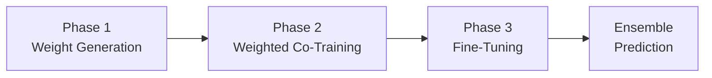

# LG-CoTrain (CrisisMMD)

**LLM-Guided Co-Training for Crisis Tweet Classification**

> **Dashboard** — View dataset exploration and experiment results: [results/dashboard.html](https://htmlpreview.github.io/?https://github.com/anhtranst/cotrain_crisisMMD/blob/main/results/dashboard.html)
> _(Rebuild anytime with `python scripts/dashboard.py`)_

A semi-supervised co-training pipeline that classifies crisis tweets and images. It combines a small set of human-labeled data with pseudo-labels from vision-language models (Llama-3.2-11B-Vision-Instruct, Qwen2.5-VL-7B-Instruct, Qwen3-VL-8B-Instruct) using a 3-phase training approach with two models. Built on the **CrisisMMD agreed-label** dataset with support for two tasks and three modalities.

---

## Table of Contents

- [Motivation](#motivation)
- [Methods](#methods)
  - [LG-CoTrain](#lg-cotrain)
  - [Vanilla Co-Training (Baseline)](#vanilla-co-training-baseline)
- [Dataset: CrisisMMD](#dataset-crisismmd)
- [Data Layout](#data-layout)
- [Installation](#installation)
- [Quick Start](#quick-start)
- [Zero-Shot Classification](#zero-shot-classification)
- [Results Dashboard](#results-dashboard)
- [Project Structure](#project-structure)
- [Testing](#testing)
- [References](#references)

---

## Motivation

During disasters, rapid classification of social media posts helps humanitarian organizations prioritize response efforts. However, manually labeling enough tweets to train a reliable classifier is slow and expensive.

LG-CoTrain addresses this by:

1. Starting with a **small set of human-labeled tweets** (as few as 5 per class)
2. Using **vision-language models (Llama-3.2-11B, Qwen2.5-VL-7B) to pseudo-label** a large pool of unlabeled data
3. Computing **per-sample reliability weights** that measure how trustworthy each pseudo-label is
4. **Co-training two classifiers** that teach each other using these weighted pseudo-labels
5. **Fine-tuning** on the small labeled set with early stopping

The result is a classifier that significantly outperforms training on labeled data alone, even when labeled data is extremely scarce.

---

## Methods

### LG-CoTrain

The main method: a 3-phase pipeline using VLM-generated pseudo-labels with learned reliability weights.



1. **Phase 1** — Two models train on labeled splits, generate probability estimates over pseudo-labeled data
2. **Phase 2** — Fresh models co-train on pseudo-labeled data with cross-weighted loss (lambda weights)
3. **Phase 3** — Fine-tune on labeled data with early stopping

```bash
python -m lg_cotrain.run_experiment --task humanitarian --modality text_only --budget 5 --seed-set 1
```

For full algorithm details, architecture diagrams, and all configuration options, see [lg_cotrain/README.md](lg_cotrain/README.md).

### Vanilla Co-Training (Baseline)

Classic co-training (Blum & Mitchell, 1998) as a baseline comparison. Two models iteratively teach each other by selecting their most confident predictions as hard labels for the other model. No external pseudo-labels, no lambda weights.

| Aspect | LG-CoTrain | Vanilla Co-Training |
|--------|-----------|-------------------|
| Pseudo-labels | External VLM (Llama, Qwen) | Models generate for each other |
| Weighting | Continuous lambda weights | Binary: selected or not |
| Structure | 3-phase pipeline | Iterative loop + fine-tuning |
| Selection | All pseudo-labels, weighted | Top-k per class by confidence |

```bash
python -m vanilla_cotrain.run_experiment --task humanitarian --modality text_only --budget 5 --seed-set 1
```

For full algorithm details, architecture diagrams, and all configuration options, see [vanilla_cotrain/README.md](vanilla_cotrain/README.md).

---

## Dataset: CrisisMMD

The dataset uses the **agreed-label subset** of CrisisMMD, containing tweets and images from **7 natural disasters** in 2017 where text and image annotators agreed on the label. Two annotation tasks:

### Tasks

| Task | Classes | Labels |
| --- | --- | --- |
| **humanitarian** (5 classes) | `affected_individuals`, `infrastructure_and_utility_damage`, `not_humanitarian`, `other_relevant_information`, `rescue_volunteering_or_donation_effort` |
| **informative** (2 classes) | `informative`, `not_informative` |

### Modalities

| Modality | Description | Co-training Model |
| --- | --- | --- |
| `text_only` | Tweet text, deduplicated by tweet_id | BERTweet (`vinai/bertweet-base`) |
| `image_only` | One row per image_id | CLIP ViT (`openai/clip-vit-base-patch32`) |
| `text_image` | Text + image paired | BERTweet + CLIP ViT fusion |

**Pseudo-label models** (zero-shot): Llama-3.2-11B-Vision-Instruct, Qwen2.5-VL-7B-Instruct, and Qwen3-VL-8B-Instruct.

### Events (7 disasters, combined in one dataset)

`california_wildfires`, `hurricane_harvey`, `hurricane_irma`, `hurricane_maria`, `iraq_iran_earthquake`, `mexico_earthquake`, `srilanka_floods`

### Split Sizes

| Task | Split | text_only | image_only / text_image |
| --- | --- | --- | --- |
| **informative** | Train | 8,293 | 9,601 |
| | Dev | 1,573 | 1,573 |
| | Test | 1,534 | 1,534 |
| **humanitarian** | Train | 5,263 | 6,126 |
| | Dev | 998 | 998 |
| | Test | 955 | 955 |

Each task/modality has **4 budget levels** (5, 10, 25, 50 labeled per class) and **3 seed sets**, giving **12 experiments per task/modality**.

---

## Data Layout

```
data/CrisisMMD/
├── original/                          # Raw source TSVs (keep as-is)
│   ├── task_humanitarian_text_img_{train,dev,test}.tsv
│   ├── task_informative_text_img_{train,dev,test}.tsv
│   ├── task_*_agreed_lab_{train,dev,test}.tsv
│   └── Readme.txt
├── data_image/                        # Images organized by event/date
│   └── {event}/{date}/{image_id}.jpg
└── tasks/                             # Preprocessed per-task, per-modality
    └── {task}/                        # informative | humanitarian
        └── {modality}/                # text_only | image_only | text_image
            ├── train.tsv
            ├── dev.tsv
            ├── test.tsv
            ├── labeled_{budget}_set{seed}.tsv
            └── unlabeled_{budget}_set{seed}.tsv
```

**File formats** (preprocessed):

| Modality | Columns |
| --- | --- |
| text_only | `tweet_id`, `tweet_text`, `class_label` |
| image_only | `image_id`, `image_path`, `class_label` |
| text_image | `tweet_id`, `image_id`, `tweet_text`, `image_path`, `class_label` |

**Pseudo-labels**: `data/pseudo_labelled/{model}/{task}/{modality}/train_pred.tsv` where `{model}` is `llama-3.2-11b`, `qwen2.5-vl-7b`, or `qwen3-vl-8b`.

---

## Installation

```bash
pip install -r requirements.txt
```

**Dependencies**: `torch`, `transformers`, `pandas`, `scikit-learn`, `numpy`, `optuna`, `pytest`

---

## Quick Start

### Preprocessing

```bash
python scripts/prepare_crisismmd.py
python scripts/prepare_crisismmd.py --tasks humanitarian --budgets 5 10
```

### LG-CoTrain

```bash
# Single experiment
python -m lg_cotrain.run_experiment --task humanitarian --modality text_only --budget 5 --seed-set 1

# All 12 experiments (4 budgets x 3 seeds)
python -m lg_cotrain.run_experiment --task humanitarian --modality text_only

# Multi-GPU with run ID
python -m lg_cotrain.run_experiment --task humanitarian --modality text_only --num-gpus 2 --run-id run-1
```

See [lg_cotrain/README.md](lg_cotrain/README.md) for all CLI options, Optuna tuning, and output format.

### Vanilla Co-Training

```bash
# Single experiment
python -m vanilla_cotrain.run_experiment --task humanitarian --modality text_only --budget 5 --seed-set 1

# All 12 experiments
python -m vanilla_cotrain.run_experiment --task humanitarian --modality text_only
```

See [vanilla_cotrain/README.md](vanilla_cotrain/README.md) for all CLI options and configuration.

---

## Zero-Shot Classification

Run zero-shot classification with vision-language models to generate pseudo-labels:

```bash
# Llama-3.2-11B-Vision-Instruct
python scripts/zeroshot_llama.py --task informative --modality text_only --split test

# Qwen2.5-VL-7B-Instruct
python scripts/zeroshot_qwen.py --task humanitarian --modality image_only --split train

# Qwen3-VL-8B-Instruct
python scripts/zeroshot_qwen.py --model-id Qwen/Qwen3-VL-8B-Instruct --task informative --modality text_only --split test
```

Results are saved to `results/zeroshot/{model}/{task}/{modality}/{split}/` with `predictions.tsv` and `metrics.json`.

#### Generate pseudo-labels from zero-shot results

```bash
python scripts/create_pseudo_labels.py --model llama-3.2-11b
python scripts/create_pseudo_labels.py --model qwen2.5-vl-7b
```

Jupyter notebooks are also available:
- **Llama**: `Notebooks/01_zeroshot_informative.ipynb`, `02_zeroshot_humanitarian.ipynb`
- **Qwen2.5**: `Notebooks/03_zeroshot_informative_qwen.ipynb`, `04_zeroshot_humanitarian_qwen.ipynb`
- **Qwen3**: `Notebooks/05_zeroshot_qwen3.ipynb`

---

## Results Dashboard

```bash
python scripts/dashboard.py
```

The dashboard has three tabs:
- **Dataset Exploration** — class distributions, event breakdown, budget split sizes
- **Zero-Shot** — per-model summary, results tables, per-class F1 heatmap
- **Co-Training Results** — all co-training metrics

---

## Project Structure

```
lg_cotrain/                          # LG-CoTrain (main method)
├── README.md                        # Algorithm docs with mermaid diagrams
├── config.py                        # LGCoTrainConfig — auto-computes paths from task/modality
├── data_loading.py                  # Data loading, TASK_LABELS, label encoding, TweetDataset/ImageDataset/MultimodalDataset
├── evaluate.py                      # Metrics (error rate, macro-F1, ECE), modality-aware ensemble prediction
├── model.py                         # BertClassifier, ImageClassifier, MultimodalClassifier + factory
├── trainer.py                       # LGCoTrainer — orchestrates the 3-phase pipeline
├── run_experiment.py                # CLI entry point (single + batch mode)
├── run_all.py                       # Batch runner: all budget x seed_set for one task/modality
├── parallel.py                      # Multi-GPU parallel execution (ProcessPoolExecutor + spawn)
├── optuna_tuner.py                  # Global Optuna hyperparameter tuner
├── optuna_per_experiment.py         # Per-experiment Optuna tuner (12 studies per task/modality)
├── utils.py                         # Seed setting, logging, EarlyStopping variants, device selection
├── weight_tracker.py                # Per-sample probability tracking and lambda weight computation
└── requirements.txt                 # Python dependencies

vanilla_cotrain/                     # Vanilla Co-Training baseline (Blum & Mitchell, 1998)
├── README.md                        # Algorithm docs with mermaid diagrams
├── config.py                        # VanillaCoTrainConfig — no pseudo-labels, iterative params
├── trainer.py                       # VanillaCoTrainer — iterative co-training loop
├── run_experiment.py                # CLI entry point: python -m vanilla_cotrain.run_experiment
└── run_all.py                       # Batch runner (sequential)

scripts/
├── dashboard.py                     # Interactive HTML dashboard generator
├── prepare_crisismmd.py             # Preprocess CrisisMMD into per-task/modality datasets
├── zeroshot_llama.py                # Zero-shot classification with Llama-3.2-11B-Vision-Instruct
├── zeroshot_qwen.py                 # Zero-shot classification with Qwen2.5-VL-7B / Qwen3-VL-8B
├── create_pseudo_labels.py          # Convert zero-shot predictions to pseudo-label TSVs
├── check_progress.py                # Standalone Optuna progress checker
├── extract_optuna_test_results.py   # Extract best Optuna params + test metrics
└── merge_optuna_results.py          # Merge Optuna results from multiple PCs

Notebooks/
├── 00_cotrain_smoke_test.ipynb      # Quick 6-experiment validation
├── 01_zeroshot_informative.ipynb    # Llama zero-shot — informative task
├── 02_zeroshot_humanitarian.ipynb   # Llama zero-shot — humanitarian task
├── 03_zeroshot_informative_qwen.ipynb # Qwen zero-shot — informative task
├── 04_zeroshot_humanitarian_qwen.ipynb # Qwen2.5 zero-shot — humanitarian task
├── 05_zeroshot_qwen3.ipynb          # Qwen3 zero-shot — both tasks
└── 05_cotrain_llama.ipynb           # Full co-training — 72 experiments, dual-GPU

tests/                               # Test suite
├── conftest.py                      # Shared pytest fixtures
├── test_config.py                   # Config path computation and defaults
├── test_data_loading.py             # Data loading, label encoding, class detection
├── test_early_stopping.py           # All 6 stopping strategy variants
├── test_evaluate.py                 # Metric computation, ECE, ensemble predict
├── test_model.py                    # Model forward/predict_proba
├── test_optuna_tuner.py             # Global Optuna tuner
├── test_optuna_per_experiment.py    # Per-experiment Optuna tuner
├── test_parallel.py                 # Multi-GPU dispatch and resume
├── test_run_all.py                  # Batch runner
├── test_run_experiment.py           # CLI argument parsing
├── test_trainer.py                  # Full pipeline integration
├── test_utils.py                    # Seed, EarlyStopping, device
├── test_weight_tracker.py           # Lambda weight computation, seeding
├── test_check_progress.py           # Progress checker script
├── test_extract_optuna_test_results.py  # Result extraction script
├── test_merge_optuna_results.py     # Result merger script
├── test_dashboard.py                # Dashboard generation
├── test_vanilla_config.py           # Vanilla co-training config tests
└── test_vanilla_trainer.py          # Vanilla co-training trainer tests

docs/
└── Cornelia etal2025-Cotraining.pdf # Reference paper

data/CrisisMMD/                      # Dataset (see Data Layout above)
```

---

## Testing

```bash
# Full test suite
python -m pytest tests/ -v

# Single test file
python -m pytest tests/test_weight_tracker.py -v

# Pure-Python tests (no torch/transformers required)
python -m unittest tests/test_config.py
python -m unittest tests/test_weight_tracker.py
python -m unittest tests/test_data_loading.py
```

---

## References

**LG-CoTrain**:

> Md Mezbaur Rahman and Cornelia Caragea. 2025. **LLM-Guided Co-Training for Text Classification**. In _Proceedings of the 2025 Conference on Empirical Methods in Natural Language Processing (EMNLP)_, pages 31092–31109. Association for Computational Linguistics.

- arXiv: [https://arxiv.org/abs/2509.16516](https://arxiv.org/abs/2509.16516)
- Local copy: [`docs/Cornelia etal2025-Cotraining.pdf`](docs/Cornelia%20etal2025-Cotraining.pdf)

**Vanilla Co-Training**:

> Avrim Blum and Tom Mitchell. 1998. **Combining Labeled and Unlabeled Data with Co-Training**. In _Proceedings of the 11th Annual Conference on Computational Learning Theory (COLT)_, pages 92–100. ACM.

- ACM: [https://dl.acm.org/doi/10.1145/279943.279962](https://dl.acm.org/doi/10.1145/279943.279962)

**Dataset**:

> Firoj Alam, Ferda Ofli, and Muhammad Imran. 2018. **CrisisMMD: Multimodal Crisis Dataset**. In _Proceedings of the International AAAI Conference on Web and Social Media (ICWSM)_.
