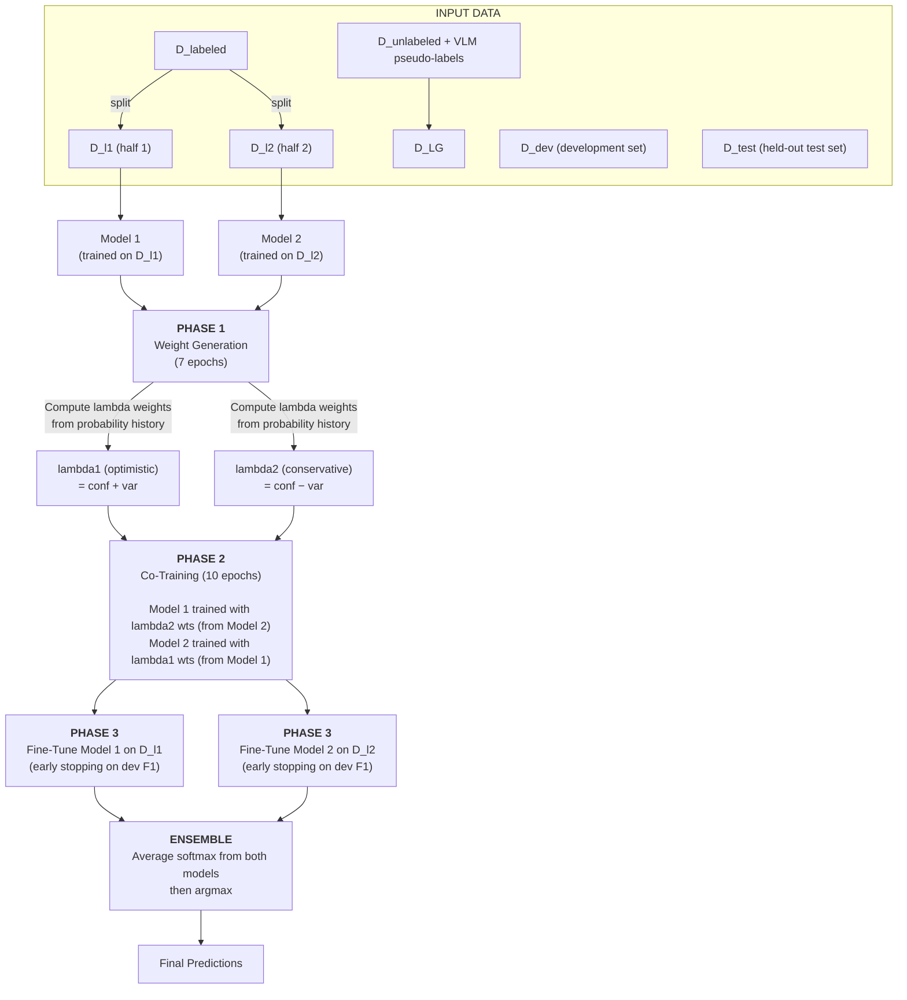
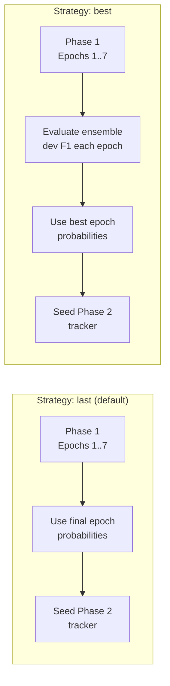
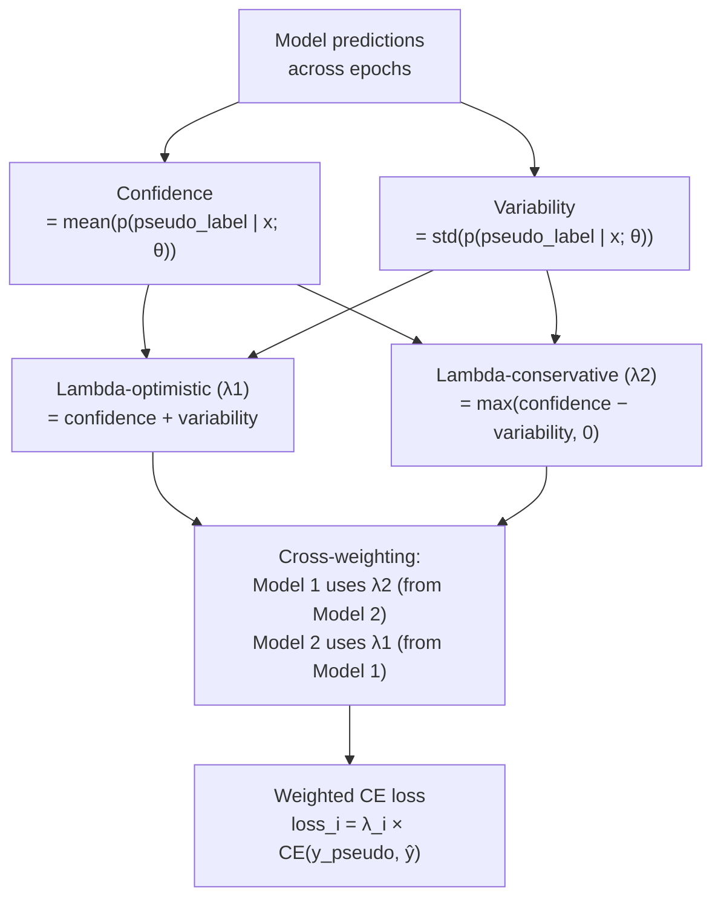
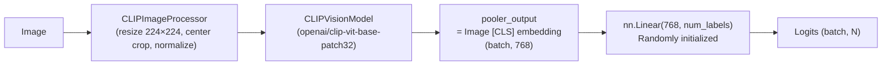
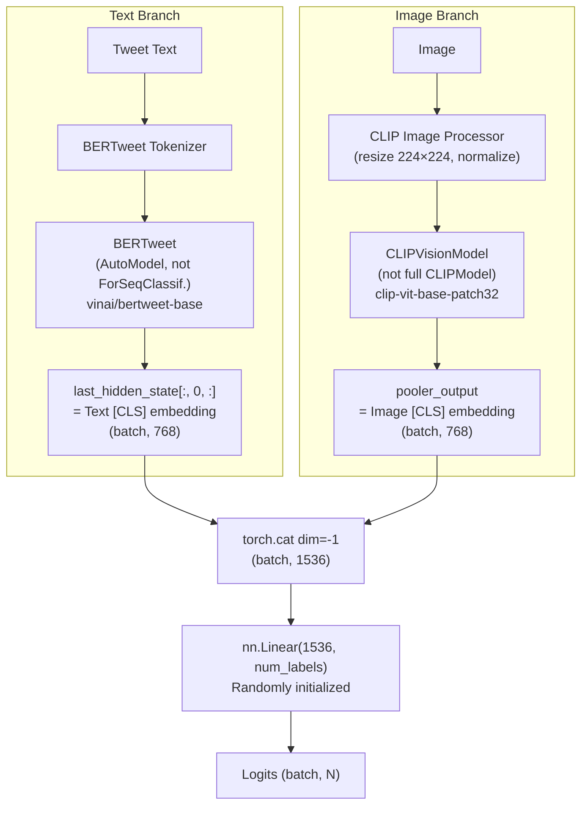
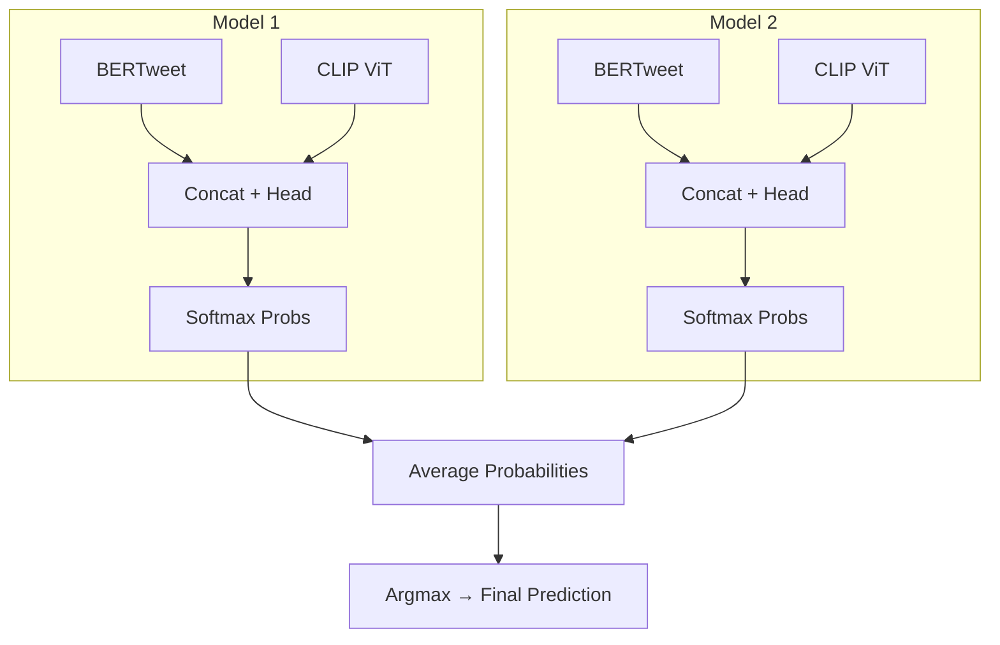
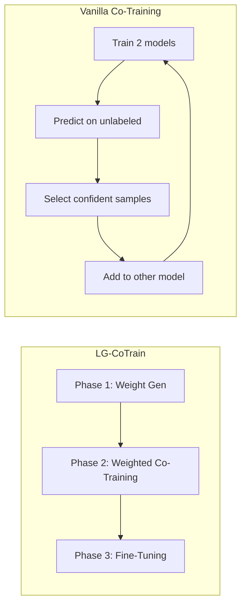

# LG-CoTrain

**LLM-Guided Co-Training for Crisis Tweet Classification**

A semi-supervised 3-phase co-training pipeline. Two models learn per-sample reliability weights for VLM-generated pseudo-labels, co-train on the weighted pseudo-labeled data, then fine-tune on a small labeled set. The ensemble of both models produces the final predictions.

> **Reference**: Md Mezbaur Rahman and Cornelia Caragea. 2025. *LLM-Guided Co-Training for Text Classification.* EMNLP 2025. [arXiv](https://arxiv.org/abs/2509.16516) | [Local copy](../docs/Cornelia%20etal2025-Cotraining.pdf)

---

## Table of Contents

- [Overview](#overview)
- [Algorithm](#algorithm)
  - [3-Phase Pipeline](#3-phase-pipeline)
  - [Phase 1 — Weight Generation](#phase-1--weight-generation)
  - [Phase 2 — Co-Training](#phase-2--co-training)
  - [Phase 3 — Fine-Tuning](#phase-3--fine-tuning)
  - [Early Stopping Strategies](#early-stopping-strategies)
- [Lambda Weight Computation](#lambda-weight-computation)
- [Model Architecture per Modality](#model-architecture-per-modality)
  - [text_only — BERTweet](#text_only--bertweet-bertclassifier)
  - [image_only — CLIP ViT](#image_only--clip-vit-imageclassifier)
  - [text_image — Late Fusion](#text_image--late-fusion-multimodalclassifier)
  - [Co-Training with Two Models](#co-training-with-two-models)
- [Comparison with Vanilla Co-Training](#comparison-with-vanilla-co-training)
- [Usage](#usage)
  - [Single Experiment](#single-experiment)
  - [Batch Mode](#batch-mode)
  - [Multi-GPU and Run ID](#multi-gpu-and-run-id)
  - [Custom Pseudo-Label Source](#custom-pseudo-label-source)
  - [Hyperparameter Tuning with Optuna](#hyperparameter-tuning-with-optuna)
  - [All CLI Options](#all-cli-options)
- [Output Format](#output-format)
- [Configuration](#configuration)
- [Design Decisions](#design-decisions)

---

## Overview

LG-CoTrain uses vision-language models (Llama-3.2-11B, Qwen2.5-VL-7B, Qwen3-VL-8B) to pseudo-label a large pool of unlabeled crisis tweets. Instead of treating all pseudo-labels equally, it computes **per-sample reliability weights** (lambda) based on how confidently and consistently two models predict each sample's pseudo-label. These weights guide co-training: trustworthy pseudo-labels contribute more to the loss, uncertain ones contribute less.

The key insight: rather than binary keep/discard decisions on pseudo-labels, LG-CoTrain uses **soft, continuous weights** that capture nuanced trust levels.

---

## Algorithm

### 3-Phase Pipeline



### Phase 1 — Weight Generation

**Goal**: Learn how much each pseudo-label can be trusted.

Two fresh models are trained **separately** — Model 1 on D_l1, Model 2 on D_l2 (stratified halves of the small labeled set). After training, each model predicts softmax probabilities for every sample in the pseudo-labeled set (D_LG). These probabilities seed Phase 2's `WeightTracker`.

```
confidence  = p(pseudo_label | x; theta) from the final Phase 1 epoch
variability = 0  (only one observation)

lambda_optimistic (lambda1)    = confidence + 0 = confidence
lambda_conservative (lambda2)  = max(confidence - 0, 0) = confidence
```

As Phase 2 proceeds, confidence and variability are recomputed as new observations accumulate each epoch.

**Intuition**:

- **High confidence, low variability** → high weight (model trusts the pseudo-label)
- **Low confidence, high variability** → low weight (model is unsure)
- lambda1 (optimistic) gives benefit of the doubt; lambda2 (conservative) is more strict

#### Phase 1 Seeding Strategy

The `--phase1-seed-strategy` flag controls which Phase 1 epoch's probabilities seed Phase 2.



| Strategy | Source | How it works |
| --- | --- | --- |
| `last` (default) | **Algorithm 1 in the paper** | Seeds with the **final** Phase 1 epoch's probabilities |
| `best` | **Our experimental extension** | Seeds from the epoch with highest ensemble dev macro-F1 |

### Phase 2 — Co-Training

**Goal**: Train strong classifiers on the large pseudo-labeled set, weighted by trust.

Two **new** models are initialized fresh. They train on D_LG using **weighted cross-entropy loss**:

- **Model 1**'s loss is weighted by **lambda2** (conservative weights from Model 2)
- **Model 2**'s loss is weighted by **lambda1** (optimistic weights from Model 1)

This cross-weighting is the core of co-training — each model guides the other.

### Phase 3 — Fine-Tuning

**Goal**: Adapt the co-trained models to the clean labeled data.

Each co-trained model fine-tunes on its respective labeled split with **early stopping**. Final evaluation uses **ensemble prediction**: average softmax from both models, then argmax.

### Early Stopping Strategies

Six strategies are available via `--stopping-strategy`:

| Strategy | Description |
| --- | --- |
| `baseline` (default) | Patience on ensemble macro-F1 |
| `no_early_stopping` | Run all epochs, restore best checkpoint |
| `per_class_patience` | Stop when every class has independently plateaued |
| `weighted_macro_f1` | Rare-class-weighted stopping metric |
| `balanced_dev` | Resampled dev set for the stopping signal |
| `scaled_threshold` | Delta scales with class imbalance ratio |

---

## Lambda Weight Computation

The `WeightTracker` records each model's softmax probability for each pseudo-labeled sample across epochs, then computes per-sample weights:



- **High confidence + low variability** → both λ1 and λ2 are high → sample has strong influence
- **Low confidence + high variability** → λ2 ≈ 0, λ1 is moderate → conservative model ignores it, optimistic model gives partial weight
- **λ2 clipping**: `max(confidence - variability, 0)` prevents negative weights that would invert the loss gradient

---

## Model Architecture per Modality

The pipeline supports three modalities, each with a different model architecture. The 3-phase algorithm is identical across all modalities — only the model, dataset, and input format change.

### text_only — BERTweet (`BertClassifier`)


BERTweet tokenizes the tweet text into `input_ids` + `attention_mask`, then `AutoModelForSequenceClassification` produces logits directly. The classification head is built into the model.

### image_only — CLIP ViT (`ImageClassifier`)



`CLIPVisionModel` (not the full `CLIPModel` — we only need the vision encoder) processes raw pixel values. The `pooler_output` is the [CLS] token projected through a pooling layer (768-dim), passed through a separate linear classification head.

### text_image — Late Fusion (`MultimodalClassifier`)



Two separate encoders process text and image independently:
- **Text branch**: `AutoModel` (not `ForSequenceClassification`) returns full hidden states. We take `last_hidden_state[:, 0, :]` — the [CLS] token at position 0 — as the 768-dim text embedding. We use `AutoModel` instead of `AutoModelForSequenceClassification` because we need the raw embedding to concatenate, not pre-classified logits.
- **Image branch**: `CLIPVisionModel` (not full `CLIPModel` — we only need the vision encoder) extracts the `pooler_output` (768-dim).
- **Fusion**: The two embeddings are concatenated into a 1536-dim vector via `torch.cat`, then a single `nn.Linear(1536, num_labels)` head classifies.
- Both encoders are **unfrozen** — gradients flow back through both BERTweet and CLIP ViT during training.
- The `nn.Linear` classification head is **randomly initialized** and learned from scratch.

### Co-Training with Two Models

The 3-phase pipeline always trains **two models of the same architecture** (Model 1 and Model 2). For `text_image`, this means two independent `MultimodalClassifier` instances, each containing its own BERTweet + CLIP ViT — **no weight sharing** between Model 1 and Model 2.



- **Phase 1**: Model 1 trains on D_l1, Model 2 trains on D_l2 → both produce probability estimates over D_LG
- **Phase 2**: Fresh Model 1 and Model 2 co-train on D_LG with cross-weighted loss (lambda weights from Phase 1)
- **Phase 3**: Fine-tune each model on its labeled split with early stopping
- **Ensemble**: Average softmax probabilities from both models, then argmax

> **GPU Memory**: `text_image` mode loads 4 transformer encoders simultaneously (2 × BERTweet + 2 × CLIP ViT ≈ 3.5 GB). With `batch_size=32`, expect ~6–8 GB total. Fits on a 16 GB+ GPU.

---

## Comparison with Vanilla Co-Training

| Aspect | LG-CoTrain | Vanilla Co-Training |
|--------|-----------|-------------------|
| **Pseudo-label source** | External VLM (Llama, Qwen) | Models generate for each other |
| **Sample weighting** | Continuous lambda weights (soft) | Binary: selected or not (hard labels) |
| **Training structure** | 3-phase pipeline | Iterative loop + fine-tuning |
| **Selection method** | All pseudo-labels used, weighted | Top-k per class by confidence |
| **Unlabeled pool** | Fixed (D_LG stays constant) | Shrinks each iteration |
| **External dependency** | Requires VLM pseudo-labels | None |



For full vanilla co-training details, see [vanilla_cotrain/README.md](../vanilla_cotrain/README.md).

---

## Usage

### Single Experiment

```bash
# Text-only (BERTweet)
python -m lg_cotrain.run_experiment \
    --task humanitarian \
    --modality text_only \
    --budget 5 \
    --seed-set 1

# Image-only (CLIP ViT)
python -m lg_cotrain.run_experiment \
    --task humanitarian \
    --modality image_only \
    --budget 5 \
    --seed-set 1

# Text+Image (BERTweet + CLIP ViT late fusion)
python -m lg_cotrain.run_experiment \
    --task humanitarian \
    --modality text_image \
    --budget 5 \
    --seed-set 1
```

### Batch Mode

Run all 12 experiments (4 budgets x 3 seeds) for a task/modality:

```bash
python -m lg_cotrain.run_experiment \
    --task humanitarian --modality text_only
```

Run specific budgets and seed sets:

```bash
python -m lg_cotrain.run_experiment \
    --task humanitarian --modality text_only \
    --budgets 5 10 --seed-sets 1 2
```

### Multi-GPU and Run ID

```bash
# Run all 12 experiments on 2 GPUs (6 per GPU)
python -m lg_cotrain.run_experiment \
    --task humanitarian --modality text_only \
    --num-gpus 2 --run-id run-1

# Different settings → increment run_id
python -m lg_cotrain.run_experiment \
    --task humanitarian --modality text_only \
    --num-gpus 2 --run-id run-2 --lr 5e-5
```

### Custom Pseudo-Label Source

```bash
python -m lg_cotrain.run_experiment \
    --task humanitarian --modality text_only \
    --pseudo-label-source qwen2.5-vl-7b \
    --output-folder results/qwen-run1
```

### Hyperparameter Tuning with Optuna

#### Global tuning

```bash
python -m lg_cotrain.optuna_tuner --n-trials 20
python -m lg_cotrain.optuna_tuner --n-trials 20 --task informative --modality text_only
python -m lg_cotrain.optuna_tuner --n-trials 20 --storage sqlite:///optuna.db
```

#### Per-experiment tuning (12 studies per task/modality)

```bash
# Run all 12 studies with 10 trials each on 2 GPUs
python -m lg_cotrain.optuna_per_experiment --n-trials 10 --num-gpus 2

# Scale to 20 trials (continues from 10)
python -m lg_cotrain.optuna_per_experiment --n-trials 20 --num-gpus 2

# Specific task/modality
python -m lg_cotrain.optuna_per_experiment --n-trials 10 \
    --task informative --modality text_only --budgets 50
```

#### Monitoring progress

```bash
python scripts/check_progress.py
python scripts/check_progress.py --watch --interval 10
```

#### Merging results from multiple PCs

```bash
python scripts/merge_optuna_results.py \
    --target results/optuna/per_experiment/humanitarian/text_only \
    --n-trials 10

python scripts/merge_optuna_results.py \
    --sources pc2_results/ pc3_results/ \
    --target results/optuna/per_experiment/humanitarian/text_only \
    --n-trials 10
```

### All CLI Options

| Option | Description | Default |
| --- | --- | --- |
| `--task` | Classification task (informative, humanitarian) | `humanitarian` |
| `--modality` | Data modality (text_only, image_only, text_image) | `text_only` |
| `--budget` | Single budget value (5, 10, 25, 50) | All budgets |
| `--budgets` | One or more budget values | All budgets |
| `--seed-set` | Single seed set (1, 2, 3) | All seed sets |
| `--seed-sets` | One or more seed sets | All seed sets |
| `--pseudo-label-source` | Model that generated pseudo-labels | `llama-3.2-11b` |
| `--output-folder` | Output folder for results | `results/` |
| `--run-id` | Run identifier (e.g. `run-1`), inserted into output path | None |
| `--model-name` | Text model (HuggingFace) | `vinai/bertweet-base` |
| `--image-model-name` | Image model for image_only/text_image | `openai/clip-vit-base-patch32` |
| `--image-size` | Image input size | `224` |
| `--weight-gen-epochs` | Phase 1 epochs | `7` |
| `--cotrain-epochs` | Phase 2 epochs | `10` |
| `--finetune-max-epochs` | Phase 3 max epochs | `100` |
| `--finetune-patience` | Early stopping patience | `5` |
| `--stopping-strategy` | Phase 3 stopping strategy | `baseline` |
| `--phase1-seed-strategy` | Phase 1→2 seeding (`last`, `best`) | `last` |
| `--batch-size` | Training batch size | `32` |
| `--lr` | Learning rate | `2e-5` |
| `--weight-decay` | AdamW weight decay | `0.01` |
| `--warmup-ratio` | LR scheduler warmup ratio | `0.1` |
| `--max-seq-length` | Max token sequence length | `128` |
| `--num-gpus` | Number of GPUs for parallel execution | `1` |
| `--data-root` | Path to data directory | `data/` |
| `--results-root` | Path to results directory | `results/` |

---

## Output Format

Results are saved to:
- Without `--run-id`: `results/cotrain/lg-cotrain/{pseudo_source}/{task}/{modality}/{budget}_set{seed}/metrics.json`
- With `--run-id run-1`: `results/cotrain/lg-cotrain/{pseudo_source}/run-1/{task}/{modality}/{budget}_set{seed}/metrics.json`

Log files: `results/cotrain/lg-cotrain/{pseudo_source}/[{run_id}/]{task}/{modality}/experiment.log`

Example `metrics.json`:

```json
{
  "task": "humanitarian",
  "modality": "text_only",
  "method": "lg-cotrain",
  "pseudo_label_source": "llama-3.2-11b",
  "budget": 5,
  "seed_set": 1,
  "test_error_rate": 35.21,
  "test_macro_f1": 0.4812,
  "test_ece": 0.082,
  "test_per_class_f1": [0.52, 0.41, 0.38, 0.29, 0.51],
  "dev_error_rate": 33.10,
  "dev_macro_f1": 0.5023,
  "dev_ece": 0.075,
  "stopping_strategy": "baseline",
  "phase1_seed_strategy": "last",
  "lambda1_mean": 0.7234,
  "lambda1_std": 0.1456,
  "lambda2_mean": 0.5891,
  "lambda2_std": 0.1823
}
```

---

## Configuration

All fields in `LGCoTrainConfig`:

| Field | Type | Default | Description |
|-------|------|---------|-------------|
| `task` | str | `"humanitarian"` | Classification task |
| `modality` | str | `"text_only"` | Data modality |
| `method` | str | `"lg-cotrain"` | Method identifier |
| `budget` | int | `5` | Labeled samples per class |
| `seed_set` | int | `1` | Seed set for reproducibility |
| `pseudo_label_source` | str | `"llama-3.2-11b"` | Pseudo-label model name |
| `run_id` | str | `None` | Run identifier for output path |
| `model_name` | str | `"vinai/bertweet-base"` | Text encoder model |
| `image_model_name` | str | `"openai/clip-vit-base-patch32"` | Image encoder model |
| `num_labels` | int | `5` | Number of classes (auto-detected) |
| `max_seq_length` | int | `128` | Max text token length |
| `image_size` | int | `224` | Image input resolution |
| `weight_gen_epochs` | int | `7` | Phase 1 training epochs |
| `cotrain_epochs` | int | `10` | Phase 2 co-training epochs |
| `finetune_max_epochs` | int | `100` | Phase 3 max fine-tuning epochs |
| `finetune_patience` | int | `5` | Early stopping patience |
| `stopping_strategy` | str | `"baseline"` | Phase 3 stopping strategy |
| `phase1_seed_strategy` | str | `"last"` | Phase 1→2 seeding strategy |
| `batch_size` | int | `32` | Training batch size |
| `lr` | float | `2e-5` | Learning rate |
| `weight_decay` | float | `0.01` | AdamW weight decay |
| `warmup_ratio` | float | `0.1` | LR scheduler warmup ratio |
| `max_unlabeled_samples` | int | `None` | Cap unlabeled pool (debug) |
| `device` | str | `None` | Device override (auto-detect) |

---

## Design Decisions

- **Task/modality-based experiments**: Experiments are organized by `(task, modality, budget, seed_set)` instead of per-event, matching CrisisMMD's all-events-combined structure
- **Modality-specific models**: BERTweet for text, CLIP ViT for images, late fusion (concat [CLS] embeddings + linear head) for text+image. `create_fresh_model()` dispatches by `config.modality`
- **Late fusion for multimodal**: Two separate encoders process text and image independently. Embeddings are concatenated before a shared classification head. Both encoders are unfrozen and trained end-to-end
- **Per-epoch lambda updates**: Paper updates per mini-batch; we update once per epoch via full evaluation pass over D_LG. More computationally stable
- **Lambda-conservative clipping**: Paper's Eq. 4 has no explicit clipping; we clip to `max(c - v, 0)`. Negative weights would invert the loss gradient
- **AdamW + LR scheduler**: Paper doesn't specify optimizer. We use AdamW with linear LR schedule + 10% warmup, following standard BERT fine-tuning practices
- **Resume support**: `run_all_experiments()` skips experiments whose `metrics.json` already exists
- **Dependency injection for testing**: `_trainer_cls` parameter allows mock trainers without importing torch
- **Configurable early stopping**: Six strategies via `--stopping-strategy`, from the paper's baseline to experimental alternatives for class-imbalanced data
