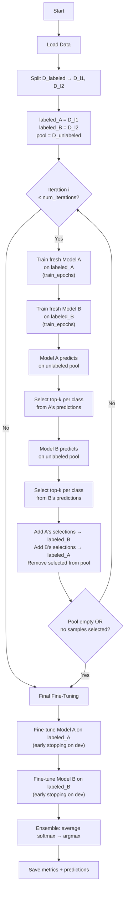
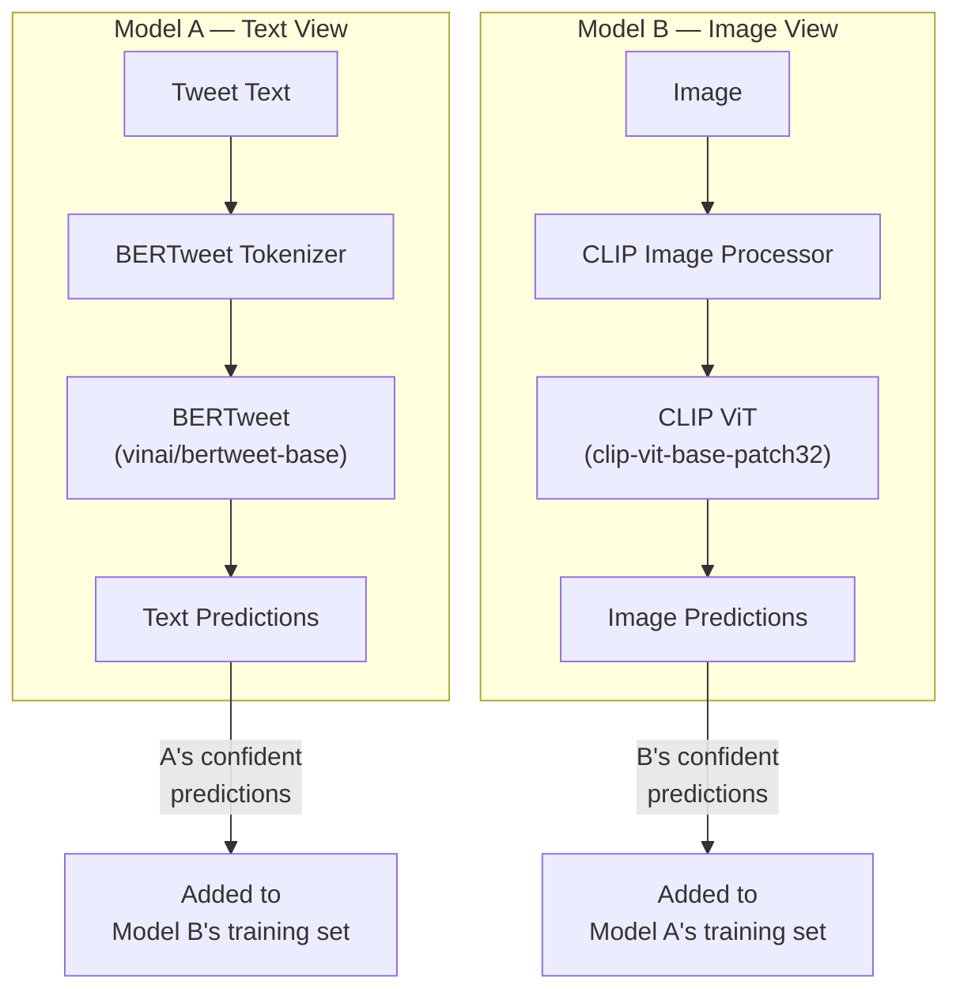
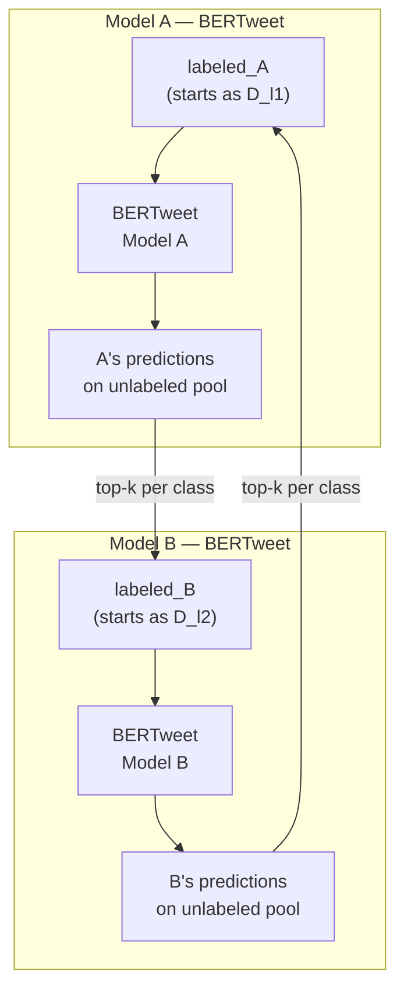
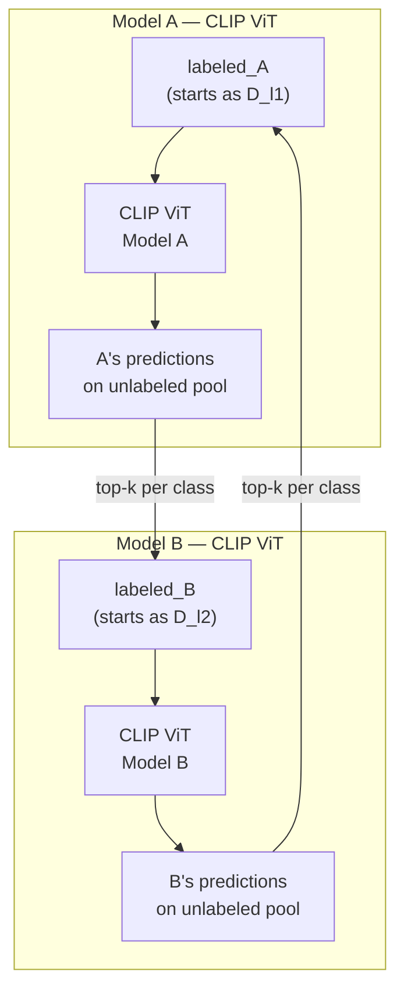
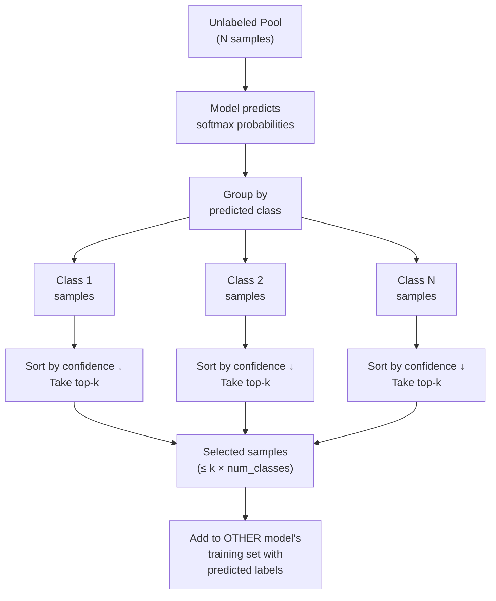
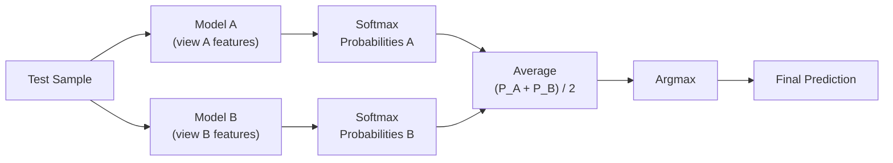
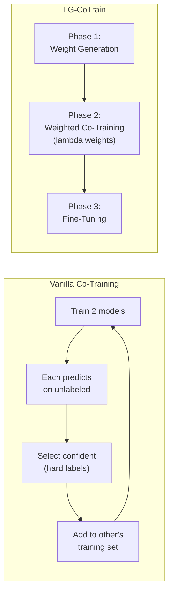

# Vanilla Co-Training

**Classic Co-Training for Crisis Tweet Classification (Blum & Mitchell, 1998)**

A baseline semi-supervised co-training method where two models iteratively teach each other. Each model selects its most confident predictions on the unlabeled pool and adds them as hard pseudo-labels to the other model's training set. No external pseudo-labels, no lambda weights, no multi-phase pipeline.

> **Reference**: Blum, A., & Mitchell, T. (1998). *Combining Labeled and Unlabeled Data with Co-Training.* COLT '98. [ACM](https://dl.acm.org/doi/10.1145/279943.279962)

---

## Table of Contents

- [Overview](#overview)
- [Algorithm](#algorithm)
  - [Step-by-Step](#step-by-step)
  - [Final Fine-Tuning](#final-fine-tuning)
- [Two-View Strategy per Modality](#two-view-strategy-per-modality)
  - [text_image — Natural Two Views](#text_image--natural-two-views)
  - [text_only — Same-Model Data Split](#text_only--same-model-data-split)
  - [image_only — Same-Model Data Split](#image_only--same-model-data-split)
- [Sample Selection: Top-k per Class](#sample-selection-top-k-per-class)
- [Ensemble Prediction](#ensemble-prediction)
- [Comparison with LG-CoTrain](#comparison-with-lg-cotrain)
- [Usage](#usage)
  - [Single Experiment](#single-experiment)
  - [Batch Mode](#batch-mode)
  - [All CLI Options](#all-cli-options)
- [Output Format](#output-format)
- [Configuration](#configuration)

---

## Overview

Vanilla co-training is designed for semi-supervised learning with two complementary "views" of the data. The core idea:

1. Start with a **small labeled set**, split into two halves (D_l1, D_l2)
2. Train two models — one per half
3. Each model labels unlabeled samples it is **most confident** about
4. These confident predictions are added as **hard labels** to the **other** model's training set
5. Repeat until convergence or the unlabeled pool is exhausted

This creates a teaching loop: Model A teaches Model B and vice versa, progressively expanding both training sets.

---

## Algorithm

### Step-by-Step



**Key properties**:
- Models are **retrained from scratch** each iteration (faithful to the original paper)
- Each model independently selects samples — they don't need to agree
- The unlabeled pool **shrinks** each iteration as samples are claimed
- Early termination if the pool is exhausted or neither model selects any samples

### Final Fine-Tuning

After the iterative loop, both models are fine-tuned on their respective (now expanded) labeled sets with early stopping based on ensemble dev macro-F1. This is analogous to Phase 3 in LG-CoTrain.

---

## Two-View Strategy per Modality

### text_image — Natural Two Views

This is the natural fit for co-training. Model A processes **text only**, Model B processes **images only**. Each teaches the other about samples it understands well from its own modality.



- Model A = `BertClassifier` (text encoder)
- Model B = `ImageClassifier` (CLIP ViT vision encoder)
- The unlabeled pool has both text and image columns; each model only sees its own modality

### text_only — Same-Model Data Split

Without two natural views, both models are **BERTweet** trained on different labeled splits (D_l1 vs D_l2). The diversity comes from the data split, not from different feature views.



### image_only — Same-Model Data Split

Same approach as text_only, but with **CLIP ViT** as the shared architecture.



---

## Sample Selection: Top-k per Class

Following the original paper, each model selects the **top-k most confident** predictions **per class** in each iteration. This maintains class balance in the pseudo-labeled data.



- Default: `samples_per_class=5` (configurable via `--samples-per-class`)
- If a class has fewer than k samples in the pool, all available samples for that class are selected
- Maximum samples added per model per iteration: `k × num_classes`

---

## Ensemble Prediction

Final predictions use ensemble averaging: softmax probabilities from both models are averaged, then argmax selects the predicted class.



For `text_image`, Model A receives only text features and Model B receives only image features. For `text_only`/`image_only`, both models receive the same features.

---

## Comparison with LG-CoTrain

| Aspect | Vanilla Co-Training | LG-CoTrain |
|--------|-------------------|------------|
| **Pseudo-label source** | Models generate for each other | External VLM (Llama, Qwen) |
| **Sample weighting** | Binary: selected or not (hard labels) | Continuous lambda weights (soft) |
| **Training structure** | Iterative loop | 3-phase pipeline |
| **Selection method** | Top-k per class by confidence | All pseudo-labels used, weighted |
| **Unlabeled pool** | Shrinks each iteration | Fixed (D_LG stays constant) |
| **Model diversity** | Different data splits (or modalities for text_image) | Different data splits only |
| **External dependency** | None | Requires VLM pseudo-labels |



---

## Usage

### Single Experiment

```bash
# Text-only
python -m vanilla_cotrain.run_experiment \
    --task humanitarian --modality text_only \
    --budget 5 --seed-set 1

# Image-only
python -m vanilla_cotrain.run_experiment \
    --task humanitarian --modality image_only \
    --budget 5 --seed-set 1

# Text+Image (natural two-view)
python -m vanilla_cotrain.run_experiment \
    --task informative --modality text_image \
    --budget 10 --seed-set 1
```

### Batch Mode

Run all 12 experiments (4 budgets x 3 seeds):

```bash
python -m vanilla_cotrain.run_experiment \
    --task humanitarian --modality text_only
```

Run specific budgets and seeds:

```bash
python -m vanilla_cotrain.run_experiment \
    --task humanitarian --modality text_only \
    --budgets 5 10 --seed-sets 1 2
```

With run ID:

```bash
python -m vanilla_cotrain.run_experiment \
    --task humanitarian --modality text_only \
    --run-id run-1
```

### All CLI Options

| Option | Description | Default |
|--------|-------------|---------|
| `--task` | Classification task (informative, humanitarian) | `humanitarian` |
| `--modality` | Data modality (text_only, image_only, text_image) | `text_only` |
| `--budget` | Single budget value (5, 10, 25, 50) | All budgets |
| `--budgets` | One or more budget values | All budgets |
| `--seed-set` | Single seed set (1, 2, 3) | All seed sets |
| `--seed-sets` | One or more seed sets | All seed sets |
| `--run-id` | Run identifier (e.g. `run-1`) | None |
| `--model-name` | Text model (HuggingFace) | `vinai/bertweet-base` |
| `--image-model-name` | Image model | `openai/clip-vit-base-patch32` |
| `--image-size` | Image input size | `224` |
| `--num-iterations` | Co-training rounds | `10` |
| `--samples-per-class` | Top-k per class per iteration | `5` |
| `--train-epochs` | Epochs per model per iteration | `5` |
| `--finetune-max-epochs` | Max fine-tuning epochs | `50` |
| `--finetune-patience` | Early stopping patience | `5` |
| `--batch-size` | Training batch size | `32` |
| `--lr` | Learning rate | `2e-5` |
| `--weight-decay` | AdamW weight decay | `0.01` |
| `--warmup-ratio` | LR scheduler warmup ratio | `0.1` |
| `--max-seq-length` | Max token sequence length | `128` |
| `--data-root` | Path to data directory | `data/` |
| `--results-root` | Path to results directory | `results/` |

---

## Output Format

Results are saved to:

```
results/cotrain/vanilla-cotrain/[{run_id}/]{task}/{modality}/{budget}_set{seed}/
    metrics.json
    test_predictions.tsv
    dev_predictions.tsv
```

Log files: `results/cotrain/vanilla-cotrain/[{run_id}/]{task}/{modality}/experiment.log`

Example `metrics.json`:

```json
{
  "task": "humanitarian",
  "modality": "text_only",
  "method": "vanilla-cotrain",
  "budget": 5,
  "seed_set": 1,
  "test_error_rate": 42.10,
  "test_macro_f1": 0.3812,
  "test_ece": 0.095,
  "test_per_class_f1": [0.42, 0.31, 0.38, 0.29, 0.51],
  "dev_macro_f1": 0.4023,
  "num_iterations_completed": 8,
  "samples_added_to_A": 180,
  "samples_added_to_B": 175,
  "final_labeled_A_size": 193,
  "final_labeled_B_size": 188,
  "unlabeled_remaining": 4910,
  "samples_per_class": 5,
  "per_iteration_log": [
    {"iteration": 1, "added_to_A": 25, "added_to_B": 25, "dev_macro_f1": 0.32},
    {"iteration": 2, "added_to_A": 24, "added_to_B": 23, "dev_macro_f1": 0.35}
  ]
}
```

---

## Configuration

All fields in `VanillaCoTrainConfig`:

| Field | Type | Default | Description |
|-------|------|---------|-------------|
| `task` | str | `"humanitarian"` | Classification task |
| `modality` | str | `"text_only"` | Data modality |
| `method` | str | `"vanilla-cotrain"` | Method identifier (fixed) |
| `budget` | int | `5` | Labeled samples per class |
| `seed_set` | int | `1` | Seed set for reproducibility |
| `run_id` | str | `None` | Run identifier for output path |
| `model_name` | str | `"vinai/bertweet-base"` | Text encoder model |
| `image_model_name` | str | `"openai/clip-vit-base-patch32"` | Image encoder model |
| `num_labels` | int | `5` | Number of classes (auto-detected) |
| `max_seq_length` | int | `128` | Max text token length |
| `image_size` | int | `224` | Image input resolution |
| `num_iterations` | int | `10` | Co-training rounds |
| `samples_per_class` | int | `5` | Top-k per class per iteration |
| `train_epochs` | int | `5` | Epochs per model per iteration |
| `finetune_max_epochs` | int | `50` | Max fine-tuning epochs |
| `finetune_patience` | int | `5` | Early stopping patience |
| `batch_size` | int | `32` | Training batch size |
| `lr` | float | `2e-5` | Learning rate |
| `weight_decay` | float | `0.01` | AdamW weight decay |
| `warmup_ratio` | float | `0.1` | LR scheduler warmup ratio |
| `max_unlabeled_samples` | int | `None` | Cap unlabeled pool (debug) |
| `device` | str | `None` | Device override (auto-detect) |
